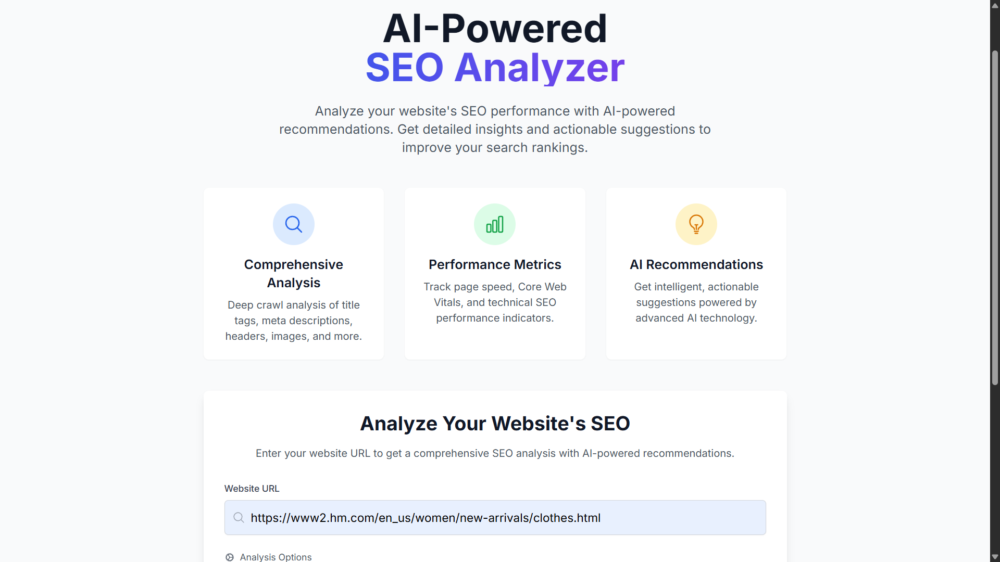
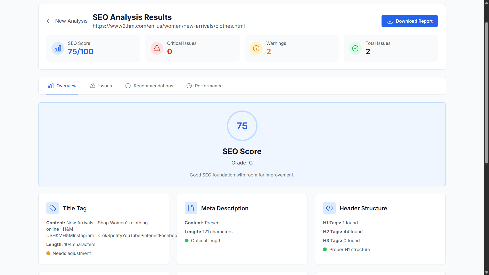
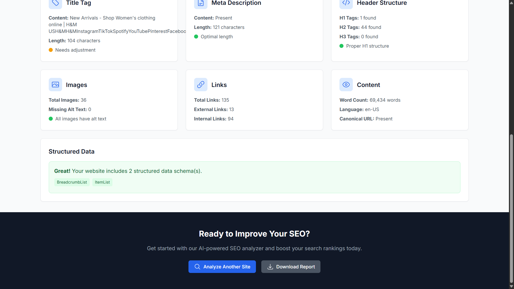

# 🧠 AI SEO Analyzer

An **AI-powered SEO optimization system** that analyzes website performance, structure, and content using **Natural Language Processing (NLP)** and **machine learning**.  
It automatically evaluates keyword relevance, readability, and on-page optimization, providing detailed reports with actionable recommendations.

---

## 🚀 Key Features
- 🔍 **Comprehensive Analysis:** Deep crawl of title tags, meta descriptions, headers, images, and links.  
- 📊 **Performance Metrics:** Tracks page speed, Core Web Vitals, and other SEO indicators.  
- 🤖 **AI Recommendations:** Provides intelligent suggestions for title, content, and structure improvements.  
- 🧩 **Automated Reporting:** Generates structured and visual reports in PDF format.  
- ⚙️ **Scalability Ready:** Supports caching, asynchronous analysis, and modular architecture.

---

## 🧩 Core Technologies
- **Backend:** Python (Flask)  
- **Frontend:** HTML, CSS, JavaScript  
- **Database:** MySQL  
- **AI Tools:** NLP, Scikit-learn, BeautifulSoup  
- **Visualization:** Matplotlib  

---

# 🧠 AI SEO Analyzer

An **AI-powered SEO optimization system** that analyzes website performance, structure, and content using **Natural Language Processing (NLP)** and **machine learning**.  
It automatically evaluates keyword relevance, readability, and on-page optimization, providing detailed reports with actionable recommendations.

---

## 🚀 Key Features
- 🔍 **Comprehensive Analysis:** Deep crawl of title tags, meta descriptions, headers, images, and links.  
- 📊 **Performance Metrics:** Tracks page speed, Core Web Vitals, and other SEO indicators.  
- 🤖 **AI Recommendations:** Provides intelligent suggestions for title, content, and structure improvements.  
- 🧩 **Automated Reporting:** Generates structured and visual reports in PDF format.  
- ⚙️ **Scalability Ready:** Supports caching, asynchronous analysis, and modular architecture.

---

## 🧩 Core Technologies
- **Backend:** Python (Flask)  
- **Frontend:** HTML, CSS, JavaScript  
- **Database:** MySQL  
- **AI Tools:** NLP, Scikit-learn, BeautifulSoup  
- **Visualization:** Matplotlib  

---

## 📸 Screenshots

### 🧭 Interface Overview

### 📈 SEO Analysis Results

### 📋 Detailed Report View

---

## 📄 Sample Report
You can view a sample generated PDF report here:  
📄 [SEO Report (PDF)](seo-report%20(8).pdf)

---

## 🧠 Role & Objective
Developed independently as part of an academic research initiative focused on **AI-based SEO automation and analytics**.  
Demonstrates strong skills in **data-driven full-stack development** and **AI integration for web analysis**.

---

## 📬 Contact
**Hashim Ali Hashmi**  
📧 [hashimalihashmi466@gmail.com](mailto:hashimalihashmi466@gmail.com)  
🌐 [GitHub Repository](https://github.com/hashimalihashmi466-bit/AI-SEO-Analyzer)
